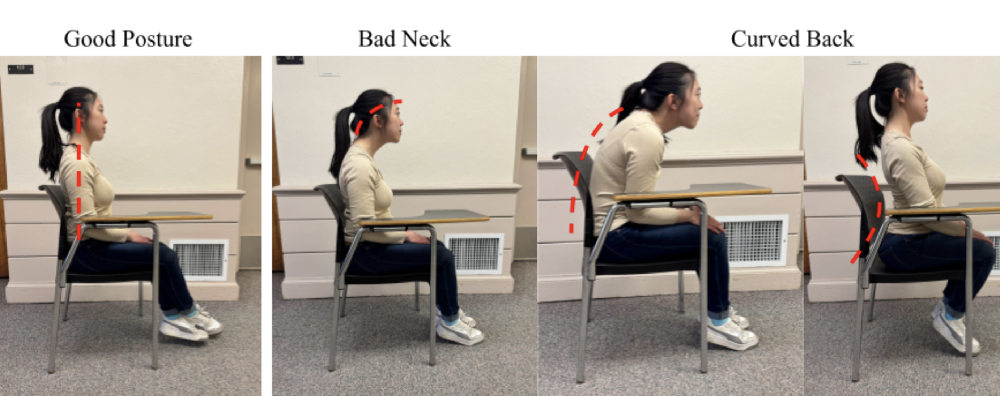

# CS 328 Final Project: Neck Posture Detector
### Amren Hossain, Emily Larkin, Kaitlyn Malsky

Our neck posture detection system utiltizes the accelerometers in Apple Airpods to classify and detect poor neck posture based off of given data.

Here are the postures that we collected our data on:

We categorized potential posture into four categories based off of the different categories of bad posture:

* Good posture: Neutral back, neck is aligned with shoulders
* Bad neck: Neck is curved forward, chin is not aligned with shoulders
* Curved back (forward): Back is not neutral, hunched forwards
* Curved back (backward): Back is not neutral, slouched backwards